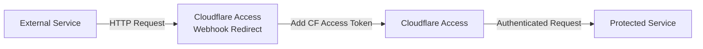

<br/>
<p align="center">
  <h1 align="center">Cloudflare Access Webhook Redirect</h1>

  <p align="center">
    A lightweight, high-performance reverse proxy for exposing specific paths from Cloudflare Access-protected services
    <br />
    <br />
    <a href="https://github.com/Timmi6790/cloudflare-access-webhook-redirect/issues">Report Bug</a>
    ·
    <a href="https://github.com/Timmi6790/cloudflare-access-webhook-redirect/issues">Request Feature</a>
  </p>
</p>

<div align="center">


[](https://codecov.io/gh/Timmi6790/cloudflare-access-webhook-redirect)


</div>

## 🎯 About The Project

Cloudflare Access Webhook Redirect is a high-performance reverse proxy written in Rust that enables selective exposure
of endpoints from services protected by Cloudflare Access. It automatically handles Cloudflare Access authentication by
injecting the required tokens into forwarded requests, allowing external services (like webhooks, monitoring tools, or
third-party integrations) to access specific paths without compromising the security of your entire application.

### Why This Project?

When using Cloudflare Access to protect your applications, you might encounter situations where:

- You need to expose webhook endpoints to external services (GitHub, Stripe, monitoring tools, etc.)
- Third-party integrations don't support Cloudflare Access authentication
- You want granular control over which endpoints are publicly accessible
- You need to maintain security while allowing selective access

This proxy sits between the external world and your Cloudflare Access-protected service, acting as an authenticated
gateway for specific paths.

## ✨ Features

| Status             | Feature                                                                                   |
|--------------------|-------------------------------------------------------------------------------------------|
| :heavy_check_mark: | **Multiple HTTP Methods** - Full support for GET, POST, PUT, PATCH, and DELETE operations |
| :heavy_check_mark: | **Path-Specific Forwarding** - Configure exactly which paths should be proxied            |
| :heavy_check_mark: | **Regex Path Matching** - Use powerful regular expressions for flexible path matching     |
| :heavy_check_mark: | **Query Parameter Support** - Preserves all query parameters in forwarded requests        |
| :heavy_check_mark: | **Request Body Forwarding** - Transparently forwards request bodies                       |
| :heavy_check_mark: | **Response Passthrough** - Returns the original response body and status code             |
| :heavy_check_mark: | **Health Check Endpoint** - Built-in `/health` endpoint for monitoring                    |
| :heavy_check_mark: | **Sentry Integration** - Optional error tracking and monitoring                           |
| :heavy_check_mark: | **Structured Logging** - Comprehensive tracing with configurable log levels               |
| :heavy_check_mark: | **Minimal Docker Image** - Secure, distroless container (~10MB) built with musl           |
| :hourglass:        | **Response Headers Forwarding** - Planned for future releases                             |

## 🏗️ Architecture



The proxy acts as an intermediary that:

1. Receives incoming requests from external services
2. Matches the request path against configured patterns
3. Injects Cloudflare Access tokens into the request
4. Forwards the request to your protected service
5. Returns the response back to the caller

## 🎯 Use Cases

- **Webhook Endpoints**: Expose GitHub webhooks, payment processor callbacks, or monitoring endpoints
- **Third-Party Integrations**: Allow services that don't support Cloudflare Access to reach specific endpoints
- **API Gateway**: Selectively expose API endpoints while keeping the rest protected
- **Monitoring**: Enable health checks and monitoring tools to access metrics endpoints

## 🚀 Quick Start

```bash
docker run -p 8080:8080 \
  -e CLOUDFLARE.CLIENT_ID=your-client-id \
  -e CLOUDFLARE.CLIENT_SECRET=your-client-secret \
  -e WEBHOOK.TARGET_BASE=https://your-protected-service.com \
  -e WEBHOOK.PATHS="/webhook/.*:ALL; /api/public/.*:POST" \
  timmi6790/cloudflare-access-webhook-redirect
```

## 📦 Installation

### Docker

```bash
docker run -d \
  --name cf-webhook-redirect \
  --restart unless-stopped \
  -p 8080:8080 \
  -e CLOUDFLARE.CLIENT_ID=your-client-id \
  -e CLOUDFLARE.CLIENT_SECRET=your-client-secret \
  -e WEBHOOK.TARGET_BASE=https://your-protected-service.com \
  -e WEBHOOK.PATHS="/webhook/.*:ALL; /api/public/.*:POST" \
  timmi6790/cloudflare-access-webhook-redirect
```

### Docker Compose

```yaml
version: '3.8'
services:
  webhook-redirect:
    image: timmi6790/cloudflare-access-webhook-redirect
    container_name: cf-webhook-redirect
    restart: unless-stopped
    ports:
      - "8080:8080"
    environment:
      - CLOUDFLARE.CLIENT_ID=your-client-id
      - CLOUDFLARE.CLIENT_SECRET=your-client-secret
      - WEBHOOK.TARGET_BASE=https://your-protected-service.com
      - WEBHOOK.PATHS=/webhook/.*:ALL; /api/public/.*:POST
      - LOG_LEVEL=info
```

### Kubernetes

```yaml
apiVersion: apps/v1
kind: Deployment
metadata:
  name: cf-webhook-redirect
  namespace: default
spec:
  replicas: 2
  selector:
    matchLabels:
      app: cf-webhook-redirect
  template:
    metadata:
      labels:
        app: cf-webhook-redirect
    spec:
      containers:
        - name: cf-webhook-redirect
          image: timmi6790/cloudflare-access-webhook-redirect
          ports:
            - containerPort: 8080
          env:
            - name: WEBHOOK.TARGET_BASE
              value: "https://your-protected-service.com"
            - name: CLOUDFLARE.CLIENT_ID
              valueFrom:
                secretKeyRef:
                  name: cf-access-credentials
                  key: client-id
            - name: CLOUDFLARE.CLIENT_SECRET
              valueFrom:
                secretKeyRef:
                  name: cf-access-credentials
                  key: client-secret
            - name: WEBHOOK.PATHS
              value: "/webhook/.*:ALL; /api/public/.*:POST"
          livenessProbe:
            httpGet:
              path: /health
              port: 8080
            initialDelaySeconds: 5
            periodSeconds: 10
          readinessProbe:
            httpGet:
              path: /health
              port: 8080
            initialDelaySeconds: 5
            periodSeconds: 10
          resources:
            requests:
              cpu: 100m
              memory: 64Mi
            limits:
              cpu: 200m
              memory: 128Mi
---
apiVersion: v1
kind: Service
metadata:
  name: cf-webhook-redirect
spec:
  selector:
    app: cf-webhook-redirect
  ports:
    - port: 80
      targetPort: 8080
  type: ClusterIP
```

### Helm Chart

The official Helm chart is available in
the [Timmi6790/helm-charts](https://github.com/Timmi6790/helm-charts/tree/main/charts/cloudflare-access-webhook-redirect)
repository.

## ⚙️ Configuration

### Environment Variables

| Variable                   | Required | Default | Description                                                                                                               |
|----------------------------|----------|---------|---------------------------------------------------------------------------------------------------------------------------|
| `CLOUDFLARE.CLIENT_ID`     | Yes      | -       | Cloudflare Access Client ID                                                                                               |
| `CLOUDFLARE.CLIENT_SECRET` | Yes      | -       | Cloudflare Access Client Secret                                                                                           |
| `WEBHOOK.TARGET_BASE`      | Yes      | -       | URL of your Cloudflare Access protected service                                                                           |
| `WEBHOOK.PATHS`            | Yes      | -       | Semicolon-space-separated list of path patterns in format `<regex>:<methods>` (e.g., `/webhook/.*:ALL; /api/.*:POST,GET`) |
| `LOG_LEVEL`                | No       | `info`  | Log level (`debug`, `info`, `warn`, `error`)                                                                              |
| `SENTRY_DSN`               | No       | -       | Sentry DSN for error tracking                                                                                             |

## 🤝 Contributing

1. Fork the Project
2. Create your Feature Branch (`git checkout -b feature/AmazingFeature`)
3. Commit your Changes (`git commit -m 'Add some AmazingFeature'`)
4. Push to the Branch (`git push origin feature/AmazingFeature`)
5. Open a Pull Request

## 📝 License

Distributed under the GPL-3.0 License. See `LICENSE` for more information.
